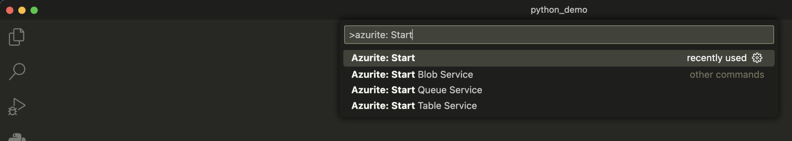
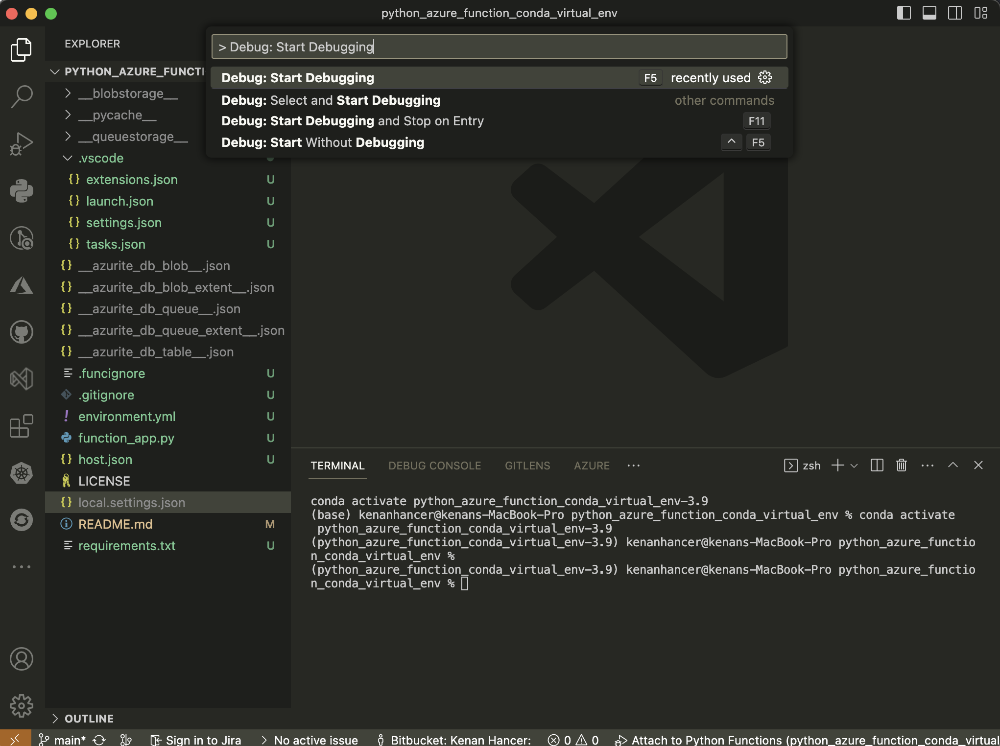
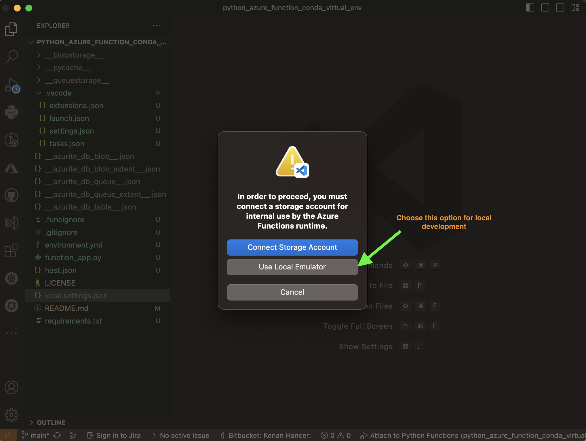
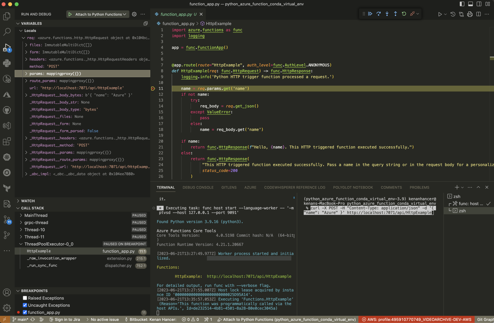

# python_azure_function_conda_virtual_env

Creating azure function and running in virtual environment created by conda

find more details how to create conda virtual environment in https://kenanhancer.com/2023/06/21/python-azure-function-debugging-in-conda-virtual-environment/?preview_id=6126&preview_nonce=2365bcc901&preview=true

## How to create virtual environment with conda

https://kenanhancer.com/2023/06/19/how-to-create-virtual-environment-with-conda/

## Creating virtual environment

```shell
$ mkdir python_demo
$ cd python_demo
```

> don't forget to update name of virtual environment name, and i added pip, ptvsd packages to debug azure function.

```shell
$ cat > environment.yml <<EOL
name: python_demo-3.9
channels:
  - defaults
dependencies:
  - python=3.9
  - pip
  - pip:
    - ptvsd
EOL
```

```shell
$ conda env create -f environment.yml

Collecting package metadata (repodata.json): done
Solving environment: done

Downloading and Extracting Packages

Preparing transaction: done
Verifying transaction: done
Executing transaction: done
Installing pip dependencies: - Ran pip subprocess with arguments:
['/opt/homebrew/Caskroom/miniconda/base/envs/python_azure_function_conda_virtual_env-3.9/bin/python', '-m', 'pip', 'install', '-U', '-r', '/Users/kenanhancer/Documents/projects/python-projects-kenanhancer/python_azure_function_conda_virtual_env/condaenv.5uk0y5ie.requirements.txt', '--exists-action=b']
Pip subprocess output:
Collecting ptvsd (from -r /Users/kenanhancer/Documents/projects/python-projects-kenanhancer/python_azure_function_conda_virtual_env/condaenv.5uk0y5ie.requirements.txt (line 1))
  Using cached ptvsd-4.3.2-py2.py3-none-any.whl (4.9 MB)
Installing collected packages: ptvsd
Successfully installed ptvsd-4.3.2

done
#
# To activate this environment, use
#
#     $ conda activate python_azure_function_conda_virtual_env-3.9
#
# To deactivate an active environment, use
#
#     $ conda deactivate
```

## Activating virtual environment

> You need to use your virtual environment name instead of **python_demo-3.9**

```shell
$ conda activate python_demo-3.9
```

## Creating Azure Function Project

```shell
$ func init --python -m V2
```

## Creating Azure Function Triggers

> Creating HTTP trigger function named HttpExample

```shell
$ func new --name HttpExample --template "HTTP trigger" --authlevel "anonymous"
```

> Creating Timer trigger function named TimerTrigger

```shell
$ func new --name TimerTrigger --template "Timer trigger"
```

> Creating Queue trigger function named QueueTrigger

```shell
$ func new --name QueueTrigger --template "Queue trigger" --authlevel "anonymous"
```

> Creating Blob trigger function named BlobTrigger

```shell
$ func new --name BlobTrigger --template "Blob trigger"
```

> Creating Cosmos DB trigger function named CosmosDBTrigger

```shell
$ func new --name CosmosDBTrigger --template "Cosmos DB trigger"
```

> Creating Service Bus Queue trigger function named ServiceBusQueueTrigger

```shell
$ func new --name ServiceBusQueueTrigger --template "Service Bus Queue trigger"
```

> Creating Service Bus Topic trigger function named ServiceBusTopicTrigger

```shell
$ func new --name ServiceBusTopicTrigger --template "Service Bus Topic trigger"
```

> Creating Event Hub trigger function named EventHubTrigger

```shell
$ func new --name EventHubTrigger --template "Event Hub trigger"
```

> Creating Event Grid trigger function named EventGridTrigger

```shell
$ func new --name EventGridTrigger --template "Event Grid trigger"
```

> Creating IoT Hub (Event Hub) trigger function named IoTHubTrigger

```shell
$ func new --name IoTHubTrigger --template "IoT Hub (Event Hub) trigger"
```

> Creating SignalR Service trigger function named SignalRTrigger

```shell
$ func new --name SignalRTrigger --template "SignalR Service trigger"
```

> Creating Durable Functions orchestrator trigger function named DurableOrchestratorTrigger

```shell
$ func new --name DurableOrchestratorTrigger --template "Durable Functions orchestrator trigger"
```

> Creating Durable Functions activity trigger function named DurableActivityTrigger

```shell
$ func new --name DurableActivityTrigger --template "Durable Functions activity trigger"
```

> Creating Durable Functions HTTP starter trigger function named DurableHTTPStarter

```shell
$ func new --name DurableHTTPStarter --template "Durable Functions HTTP starter"
```

> Creating RabbitMQ trigger function named RabbitMQTrigger

```shell
$ func new --name RabbitMQTrigger --template "RabbitMQ trigger"
```

> Creating Kafka trigger function named KafkaTrigger

```shell
$ func new --name KafkaTrigger --template "Kafka trigger"
```

## VSCode config files

### .vscode/launch.json

```json
{
  "version": "0.2.0",
  "configurations": [
    {
      "name": "Attach to Python Functions",
      "type": "python",
      "request": "attach",
      "port": 9091,
      "preLaunchTask": "func: host start"
    }
  ]
}
```

### .vscode/tasks.json

```json
{
  "version": "2.0.0",
  "tasks": [
    {
      "label": "func: host start",
      "type": "shell",
      "command": "func host start --language-worker -- '-m ptvsd --host 127.0.0.1 --port 9091'",
      "problemMatcher": "$func-python-watch",
      "isBackground": true,
      "dependsOn": "pip install (functions)"
    },
    {
      "label": "pip install (functions)",
      "type": "shell",
      "osx": {
        "command": "${config:azureFunctions.pythonVenv}/bin/python -m pip install -r requirements.txt"
      },
      "windows": {
        "command": "${config:azureFunctions.pythonVenv}\\Scripts\\python -m pip install -r requirements.txt"
      },
      "linux": {
        "command": "${config:azureFunctions.pythonVenv}/bin/python -m pip install -r requirements.txt"
      },
      "problemMatcher": []
    },
    {
      "label": "Run Azurite",
      "type": "shell",
      "command": "azurite",
      "isBackground": true,
      "problemMatcher": "$tsc"
    }
  ]
}
```

### .vscode/settings.json

>update value of **azureFunctions.pythonVenv** to your environment name. Just update python_demo-3.9 to your virtual environment name.

```json
{
  "azureFunctions.deploySubpath": ".",
  "azureFunctions.scmDoBuildDuringDeployment": true,
  "azureFunctions.pythonVenv": "/opt/homebrew/Caskroom/miniconda/base/envs/python_demo-3.9",
  "azureFunctions.projectLanguage": "Python",
  "azureFunctions.projectRuntime": "~4",
  "debug.internalConsoleOptions": "neverOpen",
  "azureFunctions.projectLanguageModel": 2
}
```

### .vscode/extensions.json

```json
{
  "recommendations": [
    "ms-azuretools.vscode-azurefunctions",
    "ms-python.python"
  ]
}
```

## Start Azurite for local emulator

>Azurite is local emulator of Azure. Azure function needs azurite so that when we run func host start , azure function app will connect to Azurite storage acount, so click **CMD+SHIFT+P** in VSCode and type azurite: start and enter.



## Debugging Azure Function locally

>Click **CMD+SHIFT+P** and type Debug: Start Debugging as shown in below screenshot or just click **F5** shortcut.



>VSCode will ask for storage account, so select Use Local Emulator for local development.



### local.settings.json

```json
{
    "IsEncrypted": false,
  "Values": {
      "FUNCTIONS_WORKER_RUNTIME": "python",
    "AzureWebJobsFeatureFlags": "EnableWorkerIndexing",
    "AzureWebJobsStorage": "UseDevelopmentStorage=true"
  }
}
```

>This will update line 6 in **local.settings.json**



## Testing Azure HTTP and Webhook Triggered Functions Locally

>GET request
```shell
$ curl http://localhost:7071/api/HttpExample\?name=Azure
```

>POST request
```shell
$ curl -X POST -H "Content-Type: application/json" -d '{ "name": "Azure" }' http://localhost:7071/api/HttpExample
```

## Testing Azure Non-HTTP Triggered Functions Locally

>POST request
```shell
$ curl --request POST -H "Content-Type: application/json" --data '{"input":"sample queue data"}' http://localhost:7071/admin/functions/QueueFunc
```

## Deactivating virtual environment

```shell
$ conda deactivate
```